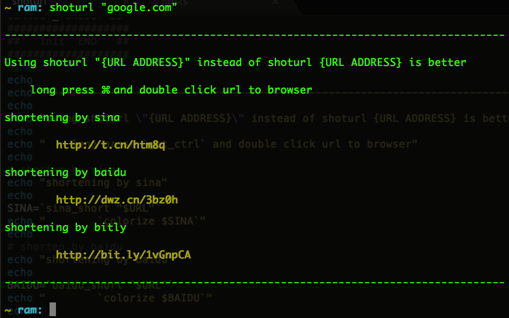

shoturl (not shortenurl or shorturl)
=======

This is a public project for shortening a long url.Currently sina/baidu/bit.ly/j.mp is supported.For some reason goo.gl can't use(timed out).

#### update note:

>`12/28/14`  add support of j.mp

>`03/05/14`  add support of dwz.cn and goo.gl 

>`01/22/14`  Just t.cn shorten url is supported up to now.


#### Before using:

```shell

chmod +x shoturl 

${PWD} is the abs path of shoturl

echo PATH=$PATH:${PWD} >> ~/.bashrc
```

#### Usage:

>shoturl "google.com" (or shoturl "http://google.com")

>


#### Thanks for using 

>twitter:[@hyongbai](http://twitter.com/hyongbai)

>weibo:[@hyongbai](http://weibo.com/hyongbai)

>gmail:[@hyongbai](mailto:hyongbai@gmail.com)

